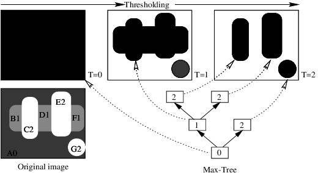
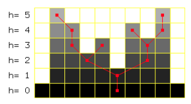
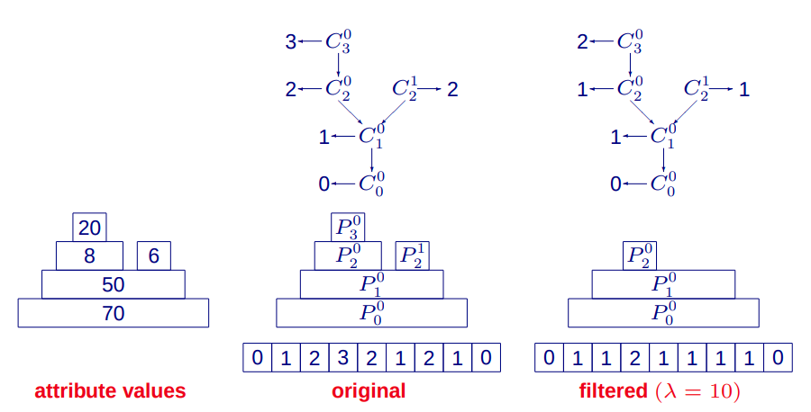

# Differential Maxtree
L. Gueguen, 2021

## Introduction

## Maxtree decomposition and filtering
### Maxtree decomposition
Maxtree are image (or signal) representations created by structuring the connected components resulting from threshold 
decomposition [1], [2]. They are also known as Component Trees [3]. They provide a multiscale description of extremas of
images and signals and are, among other things, one of the classical ways to build connected operators [4]. Let's define
few notations, to help describe the Maxtree decomposition. An image is a function mapping a pixel from grid G of dimension 
H x W to a value in the set of integers:

The set of all images adhering to the previous definition is called .
 A pixel from the grid is simply named , and its
image value is &space;\in&space;\mathbb{N}&space;).

A threshold is an operator acting on an image, which indicates if a pixel is above a value or not:

)%20=%20%5Cbegin%7Bcases%7D%200,%20&%20I(p)%5Cleqslant%20%5Clambda%20%5C%5C1,%20&%20I(p)%20%3E%20%5Clambda%20%5Cend%7Bcases%7D)

And this threshold image can be decomposed in its connected components, given a connectivity criterion on the grid. The connected
components are subsets from  which are connected. We represent this collection
of connected components at some threshold value by:

%20=%20%5C%7Bc%20%7C%20%5C:%20p%20%5Cin%20%5Cmathbb%7BG%7D,%20p%20%5Cin%20c,%20T_%5Clambda(I(p))=1,%20c%20%5C:%20%5Ctext%7Bis%20connected%7D%20%5C%7D)

The number of connected components is dependent on the input image. A connected component is a set of pixel positions on the grid.
A Maxtree extracts and represent efficiently all the connected components resulting from thresholding the image at all possible
thresholds between its minimum and maximum. The set of all connected components (CC) is:

%20=%20%5Cbigcup_%7B%5Cmin(I)%20%5Cleq%20%5Clambda%20%5Cleq%20%5Cmax(I)%7D%7BC_%5Clambda(I)%7D%20)

This resulting set of CC has redundances which is eliminated by the union operator. The Maxtree algorithm efficientlty generates
the set of unique CCs, without the need to threshold the image at each threshold. In addition, it maintains a count of appearance for each 
CC in all the threshold sets, which corresponds to the number of thresholds containing the same CC. This histogram CCs is:

=%20%5C%7B(c,h)%20%7C%20c%20%5Cin%20C%5E&plus;(I),%20h%5Cin%20%5Cmathbb%7BN%7D%5E&plus;%20%5C%7D%20)

This CC histogram is a lossless representation of the image, as it allows to reconstruct the image. The function generating 
this CC histogram, as it is unique given an image, and it allows to generate back the input image:

%20=%20%5Csum_%7Bp%5Cin%20c,%20%5C;%20(c,%20h)%20%5Cin%20C(I)%7D%7Bh%7D%20)

The Maxtree generates the CC histogram by exploiting the nested nature of the CCs at different thresholds, and organizes 
them in a tree structure as illustrated below (Credit to [5]):

The Maxtree algorithm leverages a tree data structure where each pixel maintain their relation to the conencted
components they belong through a disjoint datasets data structure. Given the Maxtree representation, all
the CCs a pixel belongs to can be retrieved by parsing the tree from leaf to its root. In other word, as you reconstruct
the image at a given pixel, you do not have to explore all the connected components, but need uniquely to traverse a 
single branch. This tree based representation is further exploited to filter the input image. 

The Maxtree algorithm can be applied to 1-D, 2-D and 3-D signals given that the underlying dense grid are equipped
with a connectivity criterion. Therefore, the Maxtree decomposition is well illustrated on 1-d signal to highlight the
nested nature of the CCs. Below the Maxtree decomposition is overlaid on a 1-D signal, where the signal support is the at
the tree root, and the signal peaks are the tree leafs:

### Maxtree filtering
There are different filtering strategies which can be applied to the Maxtree of an image. The most straighforward strategy
which interests us here is the direct rule [2], which eliminates CCs from the tree. Then, the filtered output is obtained
by reconstructing the image from the filtered tree. Let us define a criterion which indicates if a CC with its count 
is retained:

&%20%5Cmapsto%20%5C%7B0,%201%5C%7D%20%5C%5C%20c,%20%5C;%20h&%5Cto%20%20s(c,h)%20%5Cend%7Balign*%7D%20)

We will discuss later how this criterion can be built of shape attributes. The criterion uniquely defines a Maxtree filtering,
and by extension a filtering of an image. A filtered image is reconstructed as:

%20=%20%5Csum_%7B%5Cbegin%7Balign*%7Dp%20&%5Cin%20c%20%5C%5C%20s(c,h)&=1%20%5C%5C%20c,h%20&%5Cin%20C(I)%20%5Cend%7Balign*%7D%7D%20h)

Thus, a criterion along the Maxtree algorithm allows to define a filtering of any image. We denote this filtering operation
as follows:

%20=%20F%20%5Cend%7Balign*%7D%20)

A direct filtering is illustrated on a 1-D signal below (credit [6]):

### Shape attributes

A 2-d CC can be described by its shape attributes. The shape attributes is vector of k real values. As presented in [8], the shape attributes
can be efficiently computed with the MaxTree data structure from the 2d normalized moments, and some accumulation statistics.
Given these statistics translation, rotation and scale invariant attributes can be built. We generate the 7 [Hu moments](https://learnopencv.com/shape-matching-using-hu-moments-c-python/) 
for example. We provide in the table below the
attributes that we compute for each CC:

Name | Scale invariant | Rotation invariant | Translation invariant
--- | :---: | :---: | :---: 
min(x) | &check; | &cross; | &cross; 
max(x) | &cross; | &cross; | &cross; 
min(y) | &cross; | &cross; | &cross; 
max(y) | &cross; | &cross; | &cross; 
area | &cross; | &check; | &check; 
PCA large variance | &cross; | &check; | &check;
PCA small variance | &cross; | &check; | &check;
sign(Hu_x) * log(abs(Hu_x) + eps), x in 1...7 | &check; | &check; | &check;
L-shape | &check; | &check; | &check;
cos(angle) | &check; | &cross; | &check;
sin(angle) | &check; | &cross; | &check;

These attributes are used to build a criterion function, resulting into a MaxTree filter. Given the high dimension 
of the CC shape attributes, an infinity of criterion function can be defined. Determining such a function can be cubersome,
and require an optimization approach. Therefore, we a parametric approach below, to derive such criterion
and associated filters.

## Differential Maxtree filtering
This section covers the expression of a differential Maxtree based filtering. First, the direct filtering rule
is extended to a differential filtering rule. Secondly, the backpropagation derivatives are expressed on the differential
Maxtree based filtering. Finally, implementation details are given.
### Maxtree differential filtering
A Maxtree direct filtering is given from a boolean function defined on CC's attributes. However such functions are not
easily differentiable because they are not continuous. We propose to extend the definition of a criterion as being a parametric
score function mapping the CC to a real valued interval, and being differentiable:

%20&%20%5Cmapsto%20%5B0%20%5Ccdots%201%5D%20%5C%5C%20c,h%20&%5Cto%20s_%5Ctheta(c,%20h)%20%5Cend%7Balign*%7D%20)

Then, the filtered image can then be expressed by:

%20&=%20%5Csum_%7Bp%20%5Cin%20c,%20%5C:(c,h)%20%5Cin%20C(I)%7D%7B%20s_%5Ctheta(s,c)h%7D%20%5C%5C%20f_%5Ctheta(I)&=%20F_%5Ctheta%20%5Cend%7Balign*%7D)

A parametric score function is more generic than a criterion and leads to a larger set of image filters which can be differentiated.
Like convolution filters which are parametrized by the convolution kernels, the score function parameters lead to a variety
of image filters. Deeplearning has been employed to determine efficiently the best kernels of any convolution
in convolution networks [7], and the same can be achieved for a parametric Maxtree based filter.

### Backpropagation derivatives
Backpropagation is at the core of DeepLearning, and it optimizes the parameter of a function while passing the loss
derivatives down in an architecture. A layer in an architecture is a parametric function which transforms the outputs
of parents layers into outputs consumed by children layers. Let us denote a parametric layer by:

)

where the input is , the parameters are  
and the output is .

In order to find the best parameters of a layer, the backpropagation algorithm [7] computes two losses from the loss derivates
propagated from children layer. The loss derivative is . This
loss which is given by children layer is used to compute the following derivatives:  and
. The first derivative is 
used in gradient descent algorithm to optimize the layer parameters. The second derivative is propagated to parent layers.
These derivatives are expressed from the output loss derivatives by applying the chain rule:

We express below these two loss derivates for a differential Maxtree filter. We denote the parameteric Maxtree filter result:

=%5Csum_%7B(c,h)%20%5Cin%20C(I),%20%5C:p%20%5Cin%20c%7D%7Bs_%7B%5Ctheta%7D(c,h)h%7D)

The parameter loss derivatives is obtained  with the following sum:

=%5Csum_%7B(c,h)%20%5Cin%20C(I),%20%5C:p%20%5Cin%20c%7D%7B%5Cfrac%7B%5Cpartial%20s_%7B%5Ctheta%7D%7D%7B%5Cpartial%20%5Ctheta%7D(c,h)h%7D)

%20%5Cfrac%7B%5Cpartial%20O%7D%7B%5Cpartial%20%5Ctheta%7D(p)%7D)

%20%5Cin%20C(I)%7D%7B%5Cfrac%7B%5Cpartial%20s_%5Ctheta%7D%7B%5Cpartial%20%5Ctheta%7D(c,h)%20h%20%5Cleft%20(%20%5Csum_%7Bp%20%5Cin%20c%7D%7B%5Cfrac%7B%5Cpartial%20L%7D%7B%5Cpartial%20O%7D(p)%7D%20%5Cright%20)%20%7D)

Expressing the loss derivatives with respect to the input is harder and requires some approximation. We make the assumption
that all the pixels in a CC vary their greyscale values in the same way. So the CCs themselves do not vary with varitions
of the input itself:

%20=%20%5Cbegin%7Bcases%7D%20%20%20%20%20%200%20&%20%5Ctext%7Bif%20%7D%20p%20%5Cnotin%20c%20%5C%5C%20%20%20%20%20%20%5Cfrac%7B%5Cpartial%20s_%5Ctheta%7D%7B%5Cpartial%20h%7D(c,h)h%20&plus;%20s_%7B%5Ctheta%7D(c,h)%20&%20%5Ctext%7Bif%20%7D%20p%20%5Cin%20c%20%20%20%20%5Cend%7Bcases%7D%20%20%20%20)

%20=%20%5Cbegin%7Bcases%7D0%20&%20%5Ctext%7Bif%20%7D%20p%20%5Cnotin%20c%20%5C%5C%20%5Csum_%7Bq%20%5Cin%20c%7D%7B%5Cfrac%7B%5Cpartial%20L%20%7D%7B%5Cpartial%20O%7D%7D(q)%5Cfrac%7B%5Cpartial%20O%7D%7B%5Cpartial%20h%7D(q)%20&%20%5Ctext%7Bif%20%7D%20p%20%5Cin%20c%5Cend%7Bcases%7D%20%20%20)

All the pixels from a CC receive the same average derivative which is obtained as the weighted sum of the output derivatives
falling in the CC. Then, the image derivative for a given pixel is obtained by summing all derivative of CCs covering that 
pixel:

=%5Csum_%7B(c,h)%20%5Cin%20C(I),%5C:%20p%20%5Cin%20c%7D%7B%5Cfrac%7B%5Cpartial%20L%7D%7B%5Cpartial%20h%7D(p)%7D%20%20%20)

This operation is implemented by computing a loss derivative for each CC, and using this derivative value as a score
in a Maxtree filtering. The ouput of this filtering is thus the derivative of loss with respect to the input, which is 
then backpropagated to parent layers.

### Shape attributes based filtering
We propose an implementation based on the CC shape attributes. The parametric score function is a logit
score on a linear combination of each CC shape attribute. The shape attribute function is:

%20&%5Cmapsto%20%5Cmathbb%7BR%7D%5Ek%20%5C%5C%20c%20&%5Cto%20a(c)%5Cend%7Balign%7D%20%20%20)

The parametric score function is expressed from the shape attributes, its weight and its bias as:

%20=%20%5Csigma(Wa(c)&plus;b)%20%20%20)

where  is the weight vector,  is the bias 
 and is the sigmoid function. It can be noted that the parameteric
score function does not depend on the count h. This simplifies the derivative of the output to:

=%20%5Cbegin%7Bcases%7D0%20&%20%5Ctext%7Bif%20%7D%20p%20%5Cnotin%20c%20%5C%5C%20%20%20%5Csigma(Wa(c)&plus;b)%20&%20%5Ctext%7Bif%20%7D%20p%20%5Cin%20c%20%5Cend%7Bcases%7D)

Furthermore, as CC variations are not considered in our derivative simplification, it can be noted that
the attribute function does not require to be differentiable with the CC itself.
## Illustrations

## Conclusion

## References
[1] P. Salembier, A. Oliveras, and L. Garrido. Motion connected operators for image sequences, In VIII European Signal 
Processing Conference, EUSIPCO'96, pages 1083-1086, Trieste, Italy, September 1996.

[2] P. Salembier, A. Oliveras, and L. Garrido. Anti-extensive connected operators for image and sequence processing. 
IEEE Transactions on Image Processing, 7(4):555{570, April 1998.

[3] R. Jones. Component trees for image Filtering and segmentation. In 1997 IEEE Workshop on Nonlinear Signal and Image 
Processing, Mackinac Island, USA, 1997.

[4] P. Salembier and M. H. F. Wilkinson, Connected operators: A review of region-based morphological image processing 
techniques, IEEE Signal Processing Magazine, vol. 6, pp. 136–157, 2009.

[5] Philippe Salembier and Luis Garrido, Connected Operators Based On Region-Tree Pruning, 2000

[6] Michael H. F. Wilkinson, One-Hundred-and-One Uses of a Max-Tree, http://www.cs.rug.nl/~michael/mt-pres.pdf, 2004

[7] LeCun, Yann; Bengio, Yoshua (1995). "Convolutional networks for images, speech, and time series". In Arbib, Michael A. (ed.). The handbook of brain theory and neural networks (Second ed.). The MIT press. pp. 276–278.

[8] Lionel Gueguen, Classifying compound structures in satellite images: A compressed representation for fast queries, IEEE Transactions on Geoscience and Remote Sensing, 2014